# CVE-2026-57262 — Recoverable Hardcoded AES Master Key in Siemens LOGO! Soft Comfort

This write-up documents a vulnerability in the project-file encryption of Siemens LOGO! Soft
Comfort, the PC engineering software used to configure and program LOGO! BM devices. The software
lets you put a project password on a `.lsc` diagram or a `.snp` / `.mnp` network project before
sharing it. That password turns out to be of limited use: the AES-256 key used to encrypt every
project file is a static value shipped inside the application itself, so anyone with a copy of the
software can decrypt any project file, recover the password, or strip the protection off entirely.

I would like to thank Siemens ProductCERT for a genuinely smooth coordinated disclosure process.
Communication was prompt and constructive from first contact, the findings were reproduced and
acknowledged without friction, and the advisory was published to an agreed timeline. That is how
this process should work, and it deserves saying publicly.

Siemens published the finding as advisory **[SSA-751328](https://cert-portal.siemens.com/productcert/html/ssa-751328.html)**,
which splits it into two CVEs:

- **[CVE-2026-57262](https://www.cve.org/CVERecord?id=CVE-2026-57262)** — the static, hardcoded AES
  master key used to encrypt project files
  ([CWE-321](https://cwe.mitre.org/data/definitions/321.html), *Use of Hard-coded Cryptographic Key*).
- **[CVE-2026-57263](https://www.cve.org/CVERecord?id=CVE-2026-57263)** — the project password being
  stored as an unsalted SHA-256 hash, which that key exposes
  ([CWE-759](https://cwe.mitre.org/data/definitions/759.html), *Use of a One-Way Hash without a Salt*).

All versions of LOGO! Soft Comfort **prior to V9** are affected; the research described here was
carried out on V8.4.

### The Proof of Concept

The proof of concept consists of three self-contained Python scripts, each covering one step of the attack:

| Script | What it does |
|---|---|
| [`get-Logo-AES-key.py`](get-Logo-AES-key.py) | **Retrieves the static AES master key.** It asks the vendor's own `LogoKeyManager` API — inside the shipped `slsecurity.jar` — for the key, using nothing but a public method call. |
| [`Logo2Hashcat.py`](Logo2Hashcat.py) | **Retrieves the hashed user password** out of a project file's header using that key, and formats it for offline cracking with hashcat. |
| [`remove_password.py`](remove_password.py) | **Decrypts the project file** and writes back a password-free copy that LOGO! Soft Comfort opens without any prompt — no knowledge of the password required. |

Only the first script needs a LOGO! Soft Comfort installation, and only to call that one API. The
other two are pure Python against the target file alone. I leave it up to the user, to obtain the masterkey and place it in Logo2Hashcat and remove_password to make the scripts functional.

---

## Executive summary

Siemens LOGO! Soft Comfort protects diagram (`.lsc`) and network project (`.snp` / `.mnp`) files
with AES-256-GCM, and offers an optional **project password** intended to prevent unauthorized
users from opening or viewing a project's logic. The analysis below was carried out on V8.4.
Siemens has confirmed all versions prior to V9 are affected.

That password protection provides no effective confidentiality. The AES-256 key used to encrypt
every project file — internally referred to as the **`LDK83`** key — is a static, hardcoded
value shipped inside the application's own `slsecurity.jar` / `classes.jar`. It can be obtained
either by:

- calling the application's own public API, `LogoKeyManager.getLogoDiagramKey("diagramKey83")`, with a few lines of Java; or
- reading it straight out of process memory at runtime with a standard JVM profiler (VisualVM).

## Impact

With this one static key, any user who has access to a LOGO!Soft Comfort V8.4 installation —
i.e. every licensed user — can, for any `.lsc` / `.snp` / `.mnp` file, regardless of whether
a password is set:

1. **Decrypt the entire project** — diagrams, network topology, comments, properties — without
   the password.
2. **Recover the project password's unsalted SHA-256 hash** directly from the file header and
   crack it offline with standard tools (hashcat mode `1400`), with no rate limiting whatsoever.
3. **Produce a modified copy with the password removed entirely**, which LOGO!Soft Comfort opens
   without any prompt at all.

The practical consequence: a project file deliberately password-protected before being shared with
a customer, integrator, or colleague offers the sender no protection. Control logic, network
configuration, and any credentials or comments embedded in the project must be treated as
plaintext to anyone who receives the file.

Three proof-of-concept Python scripts in this repository demonstrate all of the above, end to end,
against a real password-protected project file.

## Relationship to CVE-2019-10920

In 2019, Matthias Deeg published a hardcoded-key vulnerability in the Siemens LOGO! line — tracked
as **CVE-2019-10920** and implemented in the [SySS `slig.nse` Nmap script](https://github.com/SySS-Research/slig/blob/master/slig.nse).
That advisory covers a hardcoded encryption key in the **LOGO! 8 BM device firmware** (versions
prior to v8.3), protecting project data transferred over **TCP/10005**, and allowing an
unauthenticated *network* attacker to decrypt project data in transit. The documented remediation
was to upgrade to firmware v8.3+ / LOGO!Soft Comfort V8.4, which switched the project-transfer
encryption to AES.

The issue in this write-up is a different vulnerability, in a different component, on a different
attack surface — post-remediation of CVE-2019-10920:

| | CVE-2019-10920 | CVE-2026-57262 (this write-up) |
|---|---|---|
| **Component** | LOGO! 8 BM device firmware (< v8.3) | LOGO!Soft Comfort V8.4 PC engineering software |
| **Attack surface** | Network traffic on TCP/10005 | Local `.lsc` / `.snp` / `.mnp` project files |
| **Attacker position** | Unauthenticated network attacker | Anyone holding a project file plus a LOGO!Soft Comfort installation |
| **Feature defeated** | Project-transfer confidentiality | The "project password" feature |

---

## Technical introduction

The disclosure started while building an ICS security demonstrator on a LOGO! 8.4. A project was
password-protected through the standard UI (`PasswordProtectedProject.lsc`):

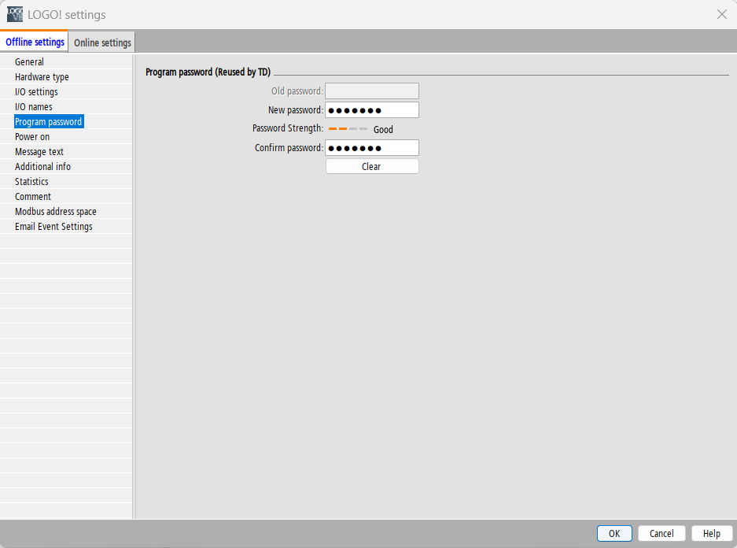

*Figure 1 — Setting a password to protect the LOGO! project in LOGO!Soft Comfort / LOGO! configuration.*

Two constraints enforced by that dialog turn out to matter a great deal later
(see [Finding 4](#finding-4--the-password-policy-makes-the-hash-trivially-crackable)):

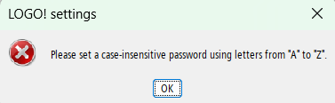

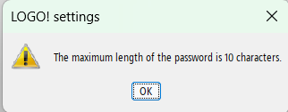

*Figures 2 & 3 — The password dialog restricts the password to case-insensitive letters `A`–`Z`,
with a maximum length of 10 characters.*

### How a project file is encrypted

Decompiling the installation's Java libraries (`\Siemens\LOGOComfort_V8.4\lib`) with
[JD-GUI](https://java-decompiler.github.io/) exposes the load/decrypt path in
`DE.siemens.ad.net.security.SecurityLoadNetworkProject` inside `classes.jar`:

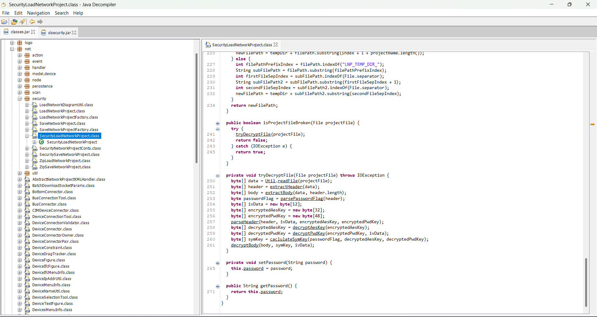

*Figure 4 — `tryDecryptFile()` in `SecurityLoadNetworkProject`, showing the full parse-and-decrypt
sequence and the header field sizes.*

Reduced to its essentials, opening a project file works like this:

```text
decryptedAesKey = AES-256-ECB-decrypt(LDK83, encryptedAesKey)        # the content key
decryptedPwdKey = AES-256-GCM-decrypt(LDK83, iv, encryptedPwdKey)    # = SHA256(password)

symKey = passwordFlag != 0 ? decryptedPwdKey XOR decryptedAesKey     # password set
                           : decryptedAesKey                         # no password

plaintext = AES-256-GCM-decrypt(symKey, iv, body)
```

Everything an attacker needs — the IV, the wrapped content key, and the wrapped password hash — is
stored in the cleartext file header. The only "secret" in the entire construction is `LDK83`, and
`LDK83` ships with the software.

### File header layout

Both header layouts were recovered from the decompiled code and confirmed against real files:

| Field | `.lsc` offset | Length | Notes |
|---|---:|---:|---|
| Header length | 119 | — | Body follows immediately |
| `passwordFlag` | 26 | 1 | `0` = no password |
| `iv` | 27 | 12 | GCM nonce, cleartext |
| `encryptedAesKey` | 39 | 32 | AES-ECB under `LDK83` |
| `encryptedPwdKey` | 71 | 48 | AES-GCM under `LDK83` (32 B ciphertext + 16 B tag) |

### Finding 1 — the master key ships with the product

`decryptAesKey()` resolves its unwrapping key through the application's own key manager:

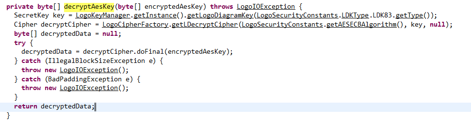

*Figure 5 — `decryptAesKey()` calling
`LogoKeyManager.getLogoDiagramKey(LogoSecurityConstants.LDKType.LDK83.getType())` — the static key
that unwraps the per-project AES content key.*

The key itself is held in a local keystore handled by `slsecurity.jar`, so tracing it statically
gets involved. It does not need to be traced. Two independent routes recover it in minutes:

**Route A — read it out of memory.** Attaching [VisualVM](https://visualvm.github.io/) to the
running application and filtering the heap dump for `SecretKeySpec` exposes the resolved 32-byte
AES key in cleartext:

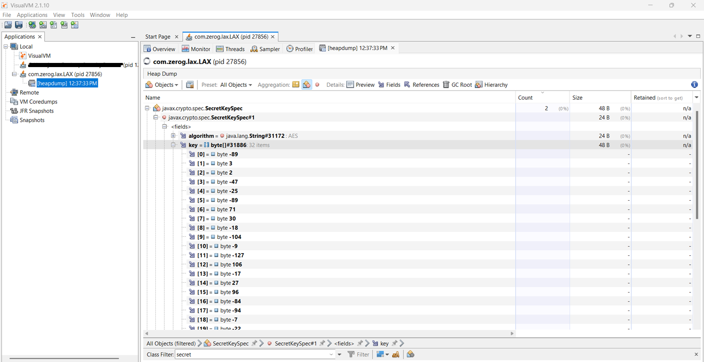

*Figure 6 — VisualVM heap dump showing the resolved `javax.crypto.spec.SecretKeySpec` for the
`LDK83` key, confirming the key is present unprotected in process memory at runtime.*

**Route B — ask the vendor's own API.** A ~15-line Java class compiled against the shipped jars asks
`LogoKeyManager` for the key directly:

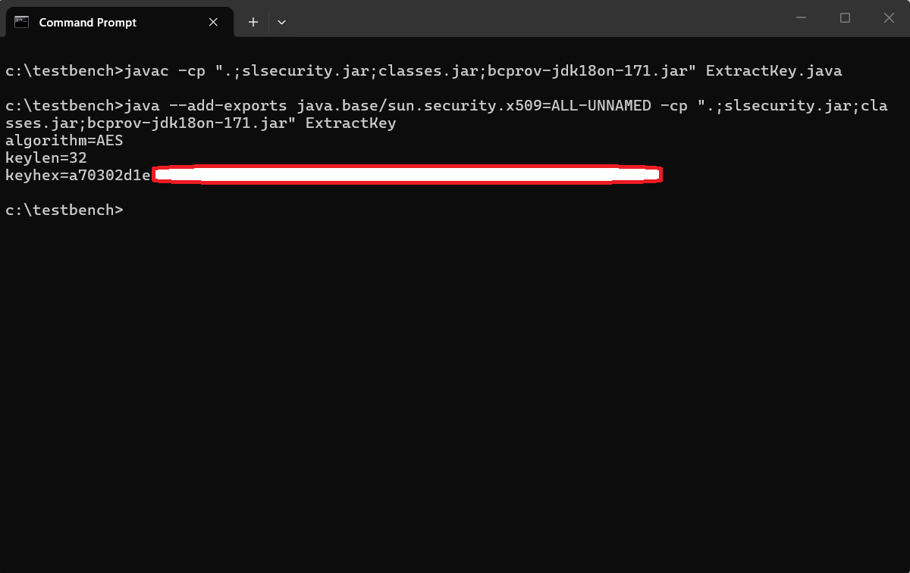

*Figure 7 — `ExtractKey.java` compiled against `slsecurity.jar`, `classes.jar` and
`bcprov-jdk18on-171.jar`, printing the AES-256 `LDK83` key.*

Both routes yield the same value, on every installation tested.

### Finding 2 — the password is mixed into the key, but adds no secrecy

When a password is set, its hash is a cryptographic input to the content key:

```text
symKey = SHA256(password) XOR decryptedAesKey
```

What makes it ineffective is where the other half lives. `SHA256(password)` is itself stored in the
file, in the `encryptedPwdKey` header field, wrapped under the static `LDK83` key. Both operands of
that XOR — the password hash and the content key — are therefore recoverable from the file alone,
using only a key that ships with every installation. The password is mixed into the key alongside
its own answer. Decryption needs `SHA256(password)`, which travels with the file; it does not need the string the
user chose. That string is only needed for the UI gate in `passwordCheck()`:

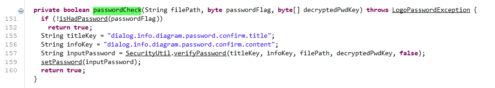

*Figure 8 — `passwordCheck()` — where the password the user types is verified, via
`SecurityUtil.verifyPassword`, in order to gate the UI. Decryption itself never requires the typed
password, because the hash it would be checked against is already present in the file.*

### Finding 3 — the stored password hash is unsalted SHA-256 bound by a limited keyspace making a bruteforce attack feasible in hours for .lsc files

`decryptedPwdKey` is a plain, unsalted, single-round `SHA256(password)`. It is stored in the file
header — encrypted, but under a key every installation possesses. Recovering it therefore requires
no password and no interaction, and it maps directly onto hashcat mode `1400` (`sha256($pass)`).

Combining this with the UI constraints from Figures 2 and 3:

- unsalted, single-round SHA-256 — the fastest possible offline cracking target;
- passwords restricted to case-insensitive `A`–`Z`;
- a maximum length of 10 characters.

The complete keyspace for the .lsc file password is therefore ~26<sup>10</sup> ≈ 1.4 × 10<sup>14</sup> candidates. A single
current-generation consumer GPU runs hashcat mode `1400` in the region of ~2 × 10<sup>10</sup>
hashes per second, which puts exhaustive search of the entire policy-permitted keyspace on the
order of a couple of hours — and dictionary attacks succeed in well under a second, as shown
below. There is no salt to force per-file work, and no rate limiting, because the attack is entirely
offline.

> [!NOTE]
> Even the strongest password the UI permits does not protect the file. Password cracking only
> matters when the attacker wants the *password itself* — for example because it is reused
> elsewhere, or to open the original file untouched. The project contents are obtainable without
> ever cracking anything (Step 4).

---

## Proof of concept

The walkthrough below runs against a real password-protected project, `PasswordProtectedProject.lsc`,
and takes it from "password-protected" to "fully decrypted, password recovered and removed" using
only the target file and the application's own unmodified library files.

### Repository contents

| File | Purpose |
|---|---|
| [`get-Logo-AES-key.py`](get-Logo-AES-key.py) | Recovers the static `LDK83` AES-256 key by calling Siemens' own `LogoKeyManager` API in the shipped jars. |
| [`Logo2Hashcat.py`](Logo2Hashcat.py) | Recovers the project password's SHA-256 hash from a project file and formats it for hashcat mode `1400`. |
| [`remove_password.py`](remove_password.py) | Rewrites a project file with the password protection removed, without knowing the password. |
| [`img/`](img/) | Screenshots referenced by this write-up. |

`Logo2Hashcat.py` and `remove_password.py` are pure Python and depend only on `pycryptodome` — they
do not need LOGO!Soft Comfort installed. Only `get-Logo-AES-key.py` touches the vendor's jars,
and it uses them solely to call an existing public API.

### Requirements

```bash
pip install pycryptodome
```

- A JDK (`java` + `javac`) on `PATH` — for `get-Logo-AES-key.py` only.
- `slsecurity.jar`, `classes.jar` and `bcprov-jdk18on-*.jar` from
  `…\Siemens\LOGOComfort_V8.4\lib` — for `get-Logo-AES-key.py` only. The sibling jars are
  auto-located next to `slsecurity.jar`.
- [hashcat](https://hashcat.net/hashcat/) — for the optional password-cracking step.

### Step 1 — extract the static AES master key

```bash
python get-Logo-AES-key.py "C:\Program Files\Siemens\LOGOComfort_V8.4\lib\slsecurity.jar"
```

The script writes a small Java helper that calls
`LogoKeyManager.getInstance().getLogoDiagramKey(LogoSecurityConstants.LDKType.LDK83.getType())`,
compiles it against the shipped jars, and prints the resulting AES-256 key.

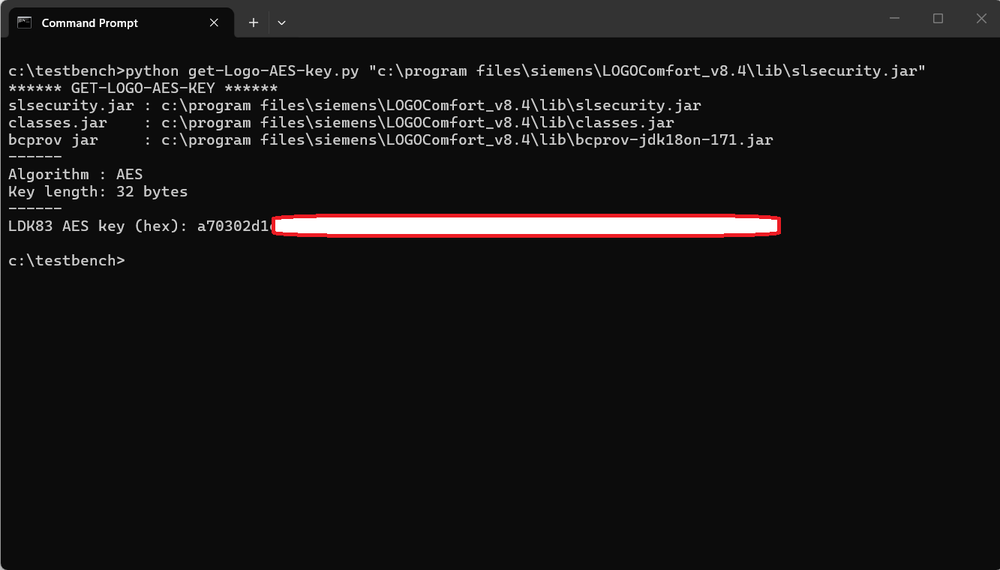

*Figure 9 — `get-Logo-AES-key.py` recovering the `LDK83` AES-256 key directly from the vendor's own
jar files.*

The recovered key is identical to the one read from process memory in Figure 6 — confirming it is a
static, version-wide constant rather than a per-installation value.

### Step 2 — recover the project password hash

```bash
python Logo2Hashcat.py PasswordProtectedProject.lsc
```

Using only the `LDK83` key, the script decrypts the header's `encryptedPwdKey` field — **no password
required** — recovering `decryptedPwdKey = SHA256(password)`, and prints a ready-to-run hashcat
command for mode `1400`.

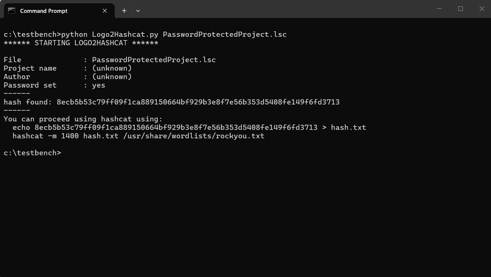

*Figure 10 — `Logo2Hashcat.py` recovering the unsalted SHA-256 password hash from
`PasswordProtectedProject.lsc` and printing a ready-to-use hashcat command.*

### Step 3 — crack the password offline

```bash
echo <hash> > hash.txt
hashcat -m 1400 hash.txt /usr/share/wordlists/rockyou.txt
```

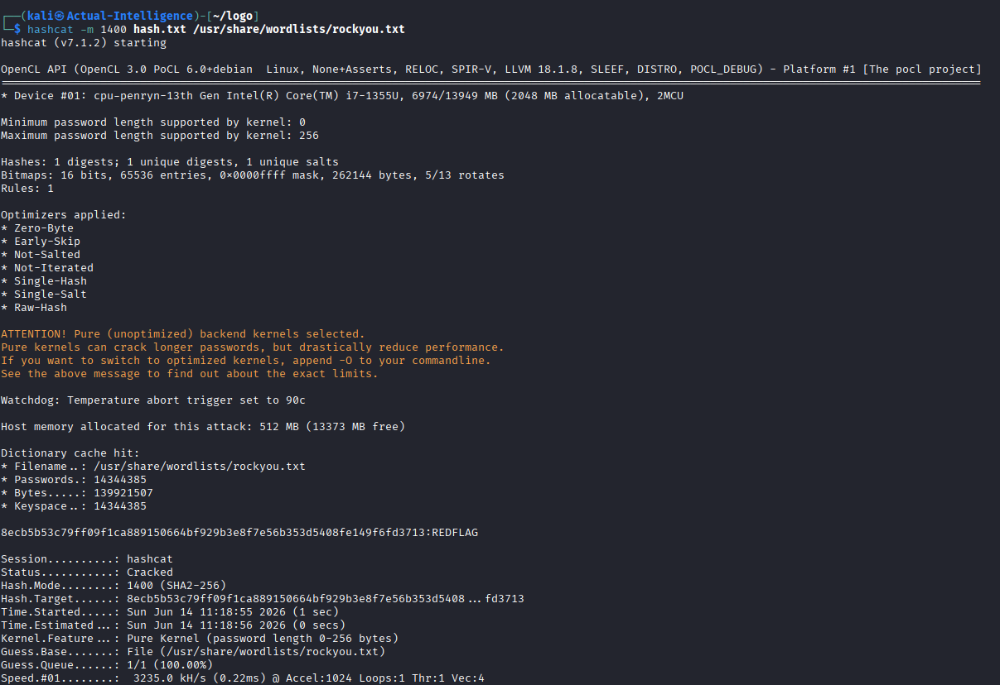

*Figure 11 — hashcat cracking the recovered hash (`Status: Cracked`), recovering the original project
password in under a second.*

### Step 4 — remove the password without knowing it

Independent of Steps 2–3, and requiring no cracking at all:

```bash
python remove_password.py PasswordProtectedProject.lsc
```

The script decrypts the project body with the `LDK83`-derived keys, then re-encrypts it with
`passwordFlag = 0`, a fresh IV, and an all-zero "password key" field — exactly the format
LOGO!Soft Comfort itself writes for a project with no password. The `encryptedAesKey` is left
untouched, so the project's content key is preserved; only the password gate disappears.

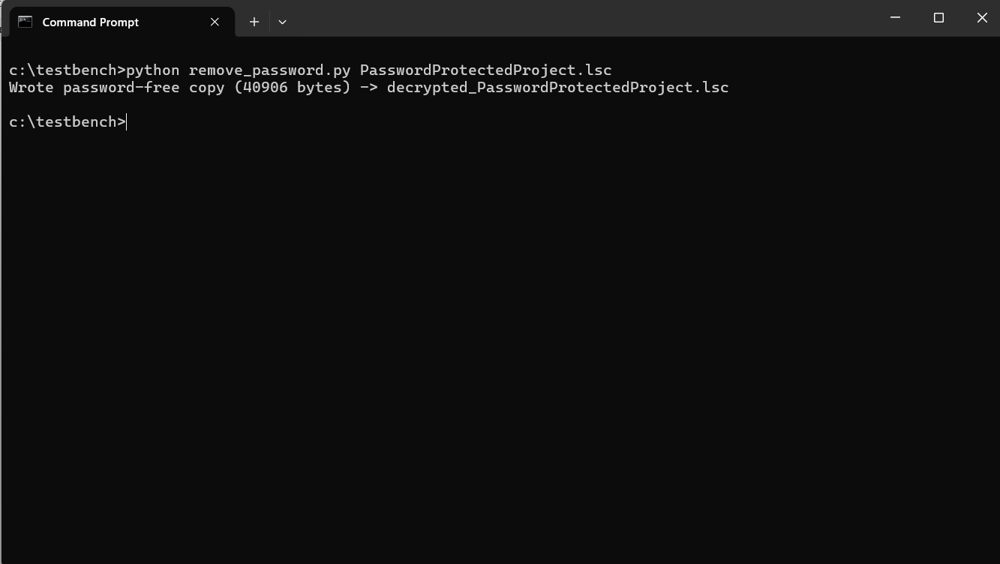

*Figure 12 — `remove_password.py` producing `decrypted_PasswordProtectedProject.lsc`, a password-free
copy with identical project contents.*

### Step 5 — confirm impact in LOGO!Soft Comfort

Opening `decrypted_PasswordProtectedProject.lsc` in LOGO!Soft Comfort succeeds with **no password
prompt at all** ("Reading successful") and displays the complete original diagram.

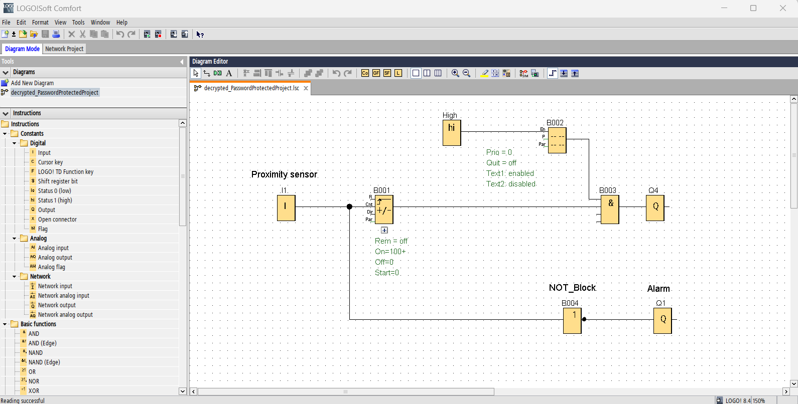

*Figure 13 — `decrypted_PasswordProtectedProject.lsc` opened in LOGO!Soft Comfort without any
password prompt, showing the full original diagram — the password protection has been completely and
silently removed.*

---

## Vendor response and acknowledgement

Siemens ProductCERT published advisory
**[SSA-751328](https://cert-portal.siemens.com/productcert/html/ssa-751328.html)** on **2026-08-11**,
covering both CVE-2026-57262 and CVE-2026-57263. The advisory confirms the finding in the vendor's own words:

> Affected products use a static, hardcoded AES master key to encrypt project files. This could
> allow a local attacker to extract the master key from the application files or memory and use it
> to decrypt project files or remove project passwords entirely without knowing the actual
> user-defined password.

**Remediation:** *"Update to V9 or later version. A hardware upgrade to LOGO! V9 BM or later is also
required to avoid compatibility mode."*

I would like to thank **Siemens ProductCERT** for the smooth and professional handling of this
report. Communication was prompt and constructive throughout, the technical findings were
acknowledged and reproduced without friction, the split into two CVEs reflected the underlying
issues accurately, and the coordinated disclosure ran to an agreed timeline from first contact to
published advisory. It is a good example of how a vendor disclosure process should work, and it is
worth saying so publicly.

## Guidance for users

The vendor provided fix is to Update to LOGO! Soft Comfort V9 or later.
Note that a hardware upgrade to a LOGO! V9 BM or later is also required, otherwise the software runs in compatibility
mode and the old file format (and therefore this issue) remains in play. While running any version prior to V9 — and for every project file already created and shared with
one:

- Treat the LOGO! **project password as an accident-prevention feature only** — it stops a colleague
  from casually opening a project; it stops nobody who wants the contents.
- **Do not use the project password as the control** when sharing project files containing sensitive
  logic, network configuration, or credentials. Use external mechanisms instead: encrypted archives
  with a strong passphrase, full-disk encryption, or authenticated secure file transfer.
- **Do not store secrets inside project files** (comments, block names, connection parameters) on the
  assumption that the password keeps them private.
- **Do not reuse the project password elsewhere.** Because it is recoverable offline from any shared
  file, a reused password becomes a credential leak beyond the LOGO! ecosystem.

## References

- Siemens Security Advisory SSA-751328 — *Recoverable Hardcoded AES Master Key in Siemens LOGO!
  Soft Comfort* (2026-08-11) —
  <https://cert-portal.siemens.com/productcert/html/ssa-751328.html>
- CVE-2026-57262 — <https://www.cve.org/CVERecord?id=CVE-2026-57262>
- CVE-2026-57263 — <https://www.cve.org/CVERecord?id=CVE-2026-57263>
- Siemens LOGO!Soft Comfort V8.4 online help, section 1.5.2 "Network file encryption" —
  <https://cache.industry.siemens.com/dl/files/561/109826561/att_1162202/v1/Help_en-US_en-US.pdf>
- CVE-2019-10920 (prior, distinct hardcoded-key finding in LOGO! 8 BM firmware) —
  <https://www.tenable.com/plugins/ot/501674>
- SySS Research, `slig` — LOGO! project data decryption for CVE-2019-10920 —
  <https://github.com/SySS-Research/slig/blob/master/slig.nse>
- JD-GUI — <https://java-decompiler.github.io/>
- VisualVM — <https://visualvm.github.io/>
- hashcat example hashes (mode 1400, `sha256($pass)`) —
  <https://hashcat.net/wiki/doku.php?id=example_hashes>

## Responsible use

> [!WARNING]
> This material is published for defensive and educational purposes, after coordinated
> disclosure to Siemens and the publication of advisory
> [SSA-751328](https://cert-portal.siemens.com/productcert/html/ssa-751328.html) with a fix available
> in V9. The tools operate only on files you already possess and on the vendor's own unmodified
> libraries.
>
> Use them exclusively against systems and files you own or are explicitly authorised to test.
> Recovering passwords from, or stripping protection off, project files belonging to others may be
> unlawful in your jurisdiction. You are responsible for your own use of this material.

